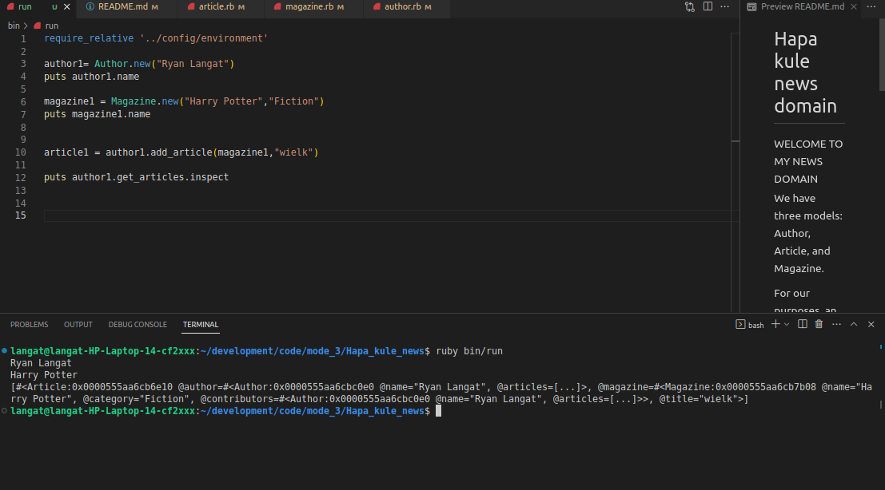

# Hapa kule news domain

<h3>WELCOME TO MY NEWS DOMAIN<h3>

We have three models: Author, Article, and Magazine.

For our purposes, an Author has many Articles, a Magazine has many Articles, and Articles belong to both Author and Magazine.

<h2>PROJECT SETUP<h2>

<small>First step is to clone the project from its respective repo<small>

    git@github.com:ryan605/Hapa_kule_news.git

<small>Then in your terminal run the following code<small>
    
       ruby bin/run

<h2>Here's an example<h2>

